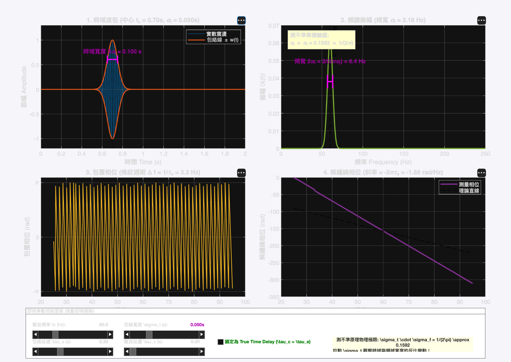
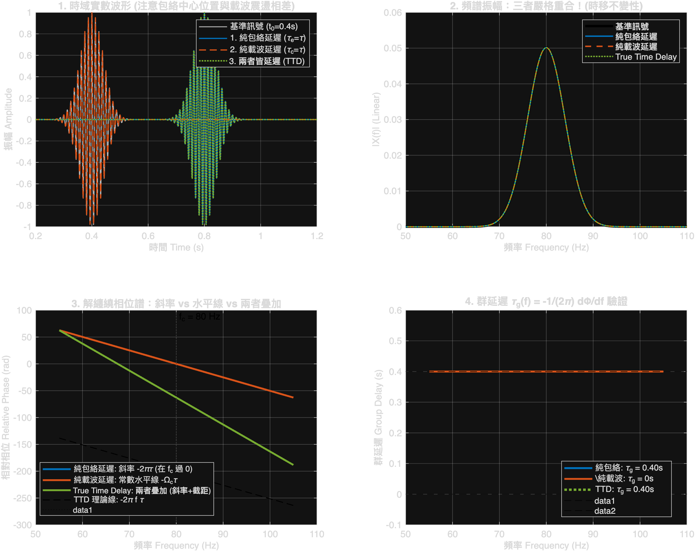

# 🌊 延遲波包（Delayed Wavepacket at $\Omega_c$）互動實驗室與三重延遲對比

> 🌐 **線上免安裝互動體驗（GitHub Pages）：**  
> **[https://tttt1314.github.io/wavepacket-studio/](https://tttt1314.github.io/wavepacket-studio/)**  
> *(支援手機、平板、電腦瀏覽器，免裝 MATLAB，即開即玩！)*

---

## 📸 互動工作台介面截圖 (Interactive Studio)

---

## 🔬 數學模型與物理推導

設高斯波包訊號為：

$$x(t) = w(t - \tau_e) \exp\left(j \Omega_c (t - \tau_c)\right)$$

其中：
- $w(t) = \exp\left(-\frac{t^2}{2\sigma_t^2}\right)$ 為高斯包絡（Gaussian Envelope）
- $\Omega_c = 2\pi f_c$ 為中心載波頻率（Carrier Frequency）
- $\tau_e$ 為包絡延遲（Envelope Delay）
- $\tau_c$ 為載波延遲（Carrier Delay）
- 訊號真實時間中心為：$t_c = t_0 + \tau_e$

---

## 📊 頻譜三大機制深度對比

### 對比彙總表

| 延遲模式 | 時域物理形式 $x(t)$ | 傅立葉轉換 $X(f)$ | 振幅譜 $|X(f)|$ | 解纏繞相位譜 $\Phi(f)$ | 幾何特徵與過零點 | 群延遲 $\tau_g(f)$ |
| :--- | :--- | :--- | :--- | :--- | :--- | :--- |
| **1. 純包絡延遲** ($\tau_e = \tau, \tau_c = 0$) | $w(t - \tau)e^{j\Omega_c t}$ | $W(f - f_c) e^{-j 2\pi (f - f_c) \tau}$ | $|W(f - f_c)|$（不變） | $-2\pi(f - f_c)\tau$ | 通過點 $(f_c, 0)$，在 $f_c$ 處相位恆為 0 | $\tau_g = \tau$ |
| **2. 純載波延遲** ($\tau_e = 0, \tau_c = \tau$) | $w(t)e^{j\Omega_c(t - \tau)}$ | $W(f - f_c) e^{-j 2\pi f_c \tau}$ | $|W(f - f_c)|$（不變） | $-2\pi f_c \tau = -\Omega_c \tau$ | **水平直線**（斜率為 0，純相移） | $\tau_g = 0$ |
| **3. True Time Delay** ($\tau_e = \tau, \tau_c = \tau$) | $w(t - \tau)e^{j\Omega_c(t - \tau)}$ | $W(f - f_c) e^{-j 2\pi f \tau}$ | $|W(f - f_c)|$（不變） | $-2\pi f \tau$ | 通過原點 $(0, 0)$，斜率為 $-2\pi\tau$ | $\tau_g = \tau$ |

---

### 三大機制的深刻物理本質：

#### 1. 純包絡延遲（Envelope-only Delay, $\tau_e = \tau, \tau_c = 0$）：
- **頻譜形式**：
  $$X(f) = W(f - f_c) \exp\left(-j 2\pi (f - f_c) \tau\right)$$
- **相位譜**：
  $$\Phi(f) = -2\pi (f - f_c) \tau$$
- **物理特徵**：是一條傾斜直線，**在載波中心頻率 $f = f_c$ 處精確過零點**！斜率為 $-2\pi\tau$，對應群延遲 $\tau_g = \tau$。

#### 2. 純載波延遲（Carrier tone-only Delay, $\tau_e = 0, \tau_c = \tau$）：
- **頻譜形式**：
  $$X(f) = W(f - f_c) \exp\left(-j 2\pi f_c \tau\right)$$
- **相位譜**：
  $$\Phi(f) = -2\pi f_c \tau = -\Omega_c \tau \quad (\text{常數})$$
- **物理特徵**：是一條**完全水平的直線**（斜率為 0，群延遲 $\tau_g = 0$），包絡在時域完全不移動，僅載波相位被旋轉。

#### 3. 兩者皆延遲（True Time Delay, $\tau_e = \tau, \tau_c = \tau$）：
- **頻譜形式**：
  $$X(f) = W(f - f_c) \exp\left(-j 2\pi f \tau\right)$$
- **相位譜**：
  $$\Phi(f) = -2\pi f \tau = \Phi_{\text{Envelope}}(f) + \Phi_{\text{Carrier}}(f)$$
- **物理特徵**：為前兩者的完美疊加！斜率由包絡延遲決定，截距由載波相移決定，反向延伸**精確通過原點 $(0, 0)$**。

#### 4. 振幅譜 $|X(f)|$ 的時移不變性：
- 三者的振幅譜**完全重合、分毫不差**，不受任何時間延遲影響；調整 $\Omega_c$ 時，振幅譜在頻率軸上產生剛體平移。

---

## ⚖️ 海森堡－加博測不準原理（Uncertainty Principle）

高斯波包是數學上唯一達到時寬－頻寬積下限等號的最優波包：

$$\sigma_t \cdot \sigma_f = \frac{1}{2\pi} \approx 0.1592$$

- **包絡調窄（$\sigma_t \downarrow$）**：時間定位越精準，頻譜頻寬 $\sigma_f$ 必然等比展寬（頻率解析度變差）。
- **包絡調寬（$\sigma_t \uparrow$）**：頻譜波峰越尖銳窄小（頻率解析度極高），但時域定位模糊。

---

## 📁 檔案清單

- [`index.html`](index.html)：零相依純 HTML5 即時互動工作室，內建 8192 點純 JavaScript Cooley-Tukey FFT（支援 GitHub Pages 一鍵部署）。
- [`wavepacket_interactive_gui.m`](wavepacket_interactive_gui.m)：MATLAB 原生互動視窗，支援動態拖曳 `fc`、`sigma_t`、`tau_e`、`tau_c` 滑桿與測不準標尺。
- [`wavepacket_three_delays_experiment.m`](wavepacket_three_delays_experiment.m)：MATLAB 批次對比實驗主腳本，輸出高解析度分析圖。
- `wavepacket_gui_snapshot.png`：互動 GUI 介面全景快照。
- `wavepacket_three_delays_comparison.png`：三重延遲機制時域、振幅、解纏繞相位與群延遲對比圖。
